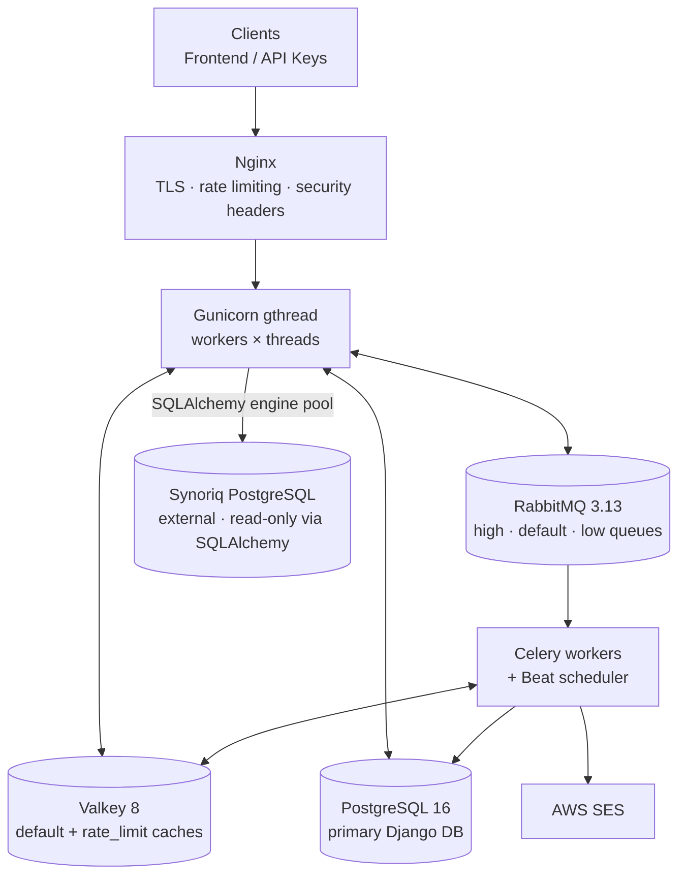
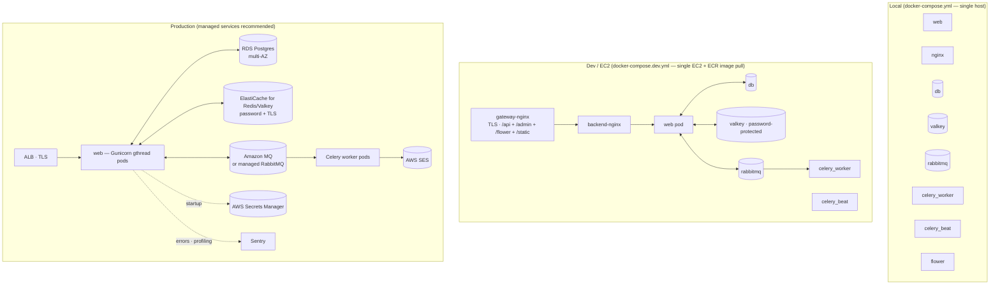

# Architecture

## System Overview

The Co-Lending Gateway is a domain-driven Django REST API that bridges internal loan management systems with external co-lending partners. It reads lead data from an external Synoriq database, manages partner configurations, and orchestrates lead pushes to partner APIs.

```
                                 ┌─────────────┐
                                 │   Clients    │
                                 │ (Frontend /  │
                                 │  API Keys)   │
                                 └──────┬───────┘
                                        │
                                 ┌──────▼───────┐
                                 │    Nginx      │
                                 │ (TLS, Rate    │
                                 │  Limiting,    │
                                 │  Security     │
                                 │  Headers)     │
                                 └──────┬───────┘
                                        │
                                 ┌──────▼───────┐
                                 │   Gunicorn    │
                                 │  (4 workers)  │
                                 └──────┬───────┘
                                        │
                    ┌───────────────────┼───────────────────┐
                    │                   │                   │
             ┌──────▼──────┐    ┌──────▼──────┐    ┌──────▼──────┐
             │  Valkey 8   │    │  RabbitMQ   │    │ PostgreSQL  │
             │ (2 caches:  │    │  3.13       │    │     16      │
             │  default +  │    │ (3 queues:  │    │ (primary    │
             │  rate_limit) │    │  high/def/  │    │  Django DB) │
             └─────────────┘    │  low)       │    └─────────────┘
                                └──────┬──────┘
                                       │
                                ┌──────▼──────┐     ┌─────────────┐
                                │   Celery     │     │  Synoriq    │
                                │  Workers     │     │  PostgreSQL │
                                │ + Beat       │     │ (external,  │
                                └──────────────┘     │  read-only) │
                                                     └─────────────┘
```

The same topology rendered as a Mermaid flowchart for GitHub preview:



The ASCII version is terminal-friendly; the Mermaid version renders on GitHub and in most viewers. Keep both.

## Request Lifecycle

1. **Nginx** receives the request, applies rate limiting zones (api: 30/s, auth: 5/s, admin: 10/s), and forwards to Gunicorn.
2. **Gunicorn** dispatches to a Django worker process.
3. **Middleware stack** processes the request in order:
   - `SecurityMiddleware` + `WhiteNoiseMiddleware` (static files, security headers)
   - `CorsMiddleware` (CORS validation)
   - `RequestIDMiddleware` (extract/generate X-Request-ID, set contextvars)
   - `ExceptionLoggingMiddleware` (catch unhandled exceptions; see [exceptions.md](exceptions.md) for the typed hierarchy and DRF handler flow)
   - `SessionMiddleware` + `AuthenticationMiddleware` (JWT/API key validation)
   - `RequestLoggingMiddleware` (structured JSON log: method, path, user, IP, duration)
   - `RateLimitHeadersMiddleware` (inject X-RateLimit-* headers)
4. **DRF throttles** check rate limits (3 tiers: anon 100/h, user 1000/h, admin 5000/h).
5. **RBAC permission** class checks User -> Roles -> Permissions for (Resource, Action).
6. **View** delegates to **Service** layer.
7. **Service** executes business logic with `@transaction.atomic` and `select_for_update()`.
8. **Response envelope** wraps the result in a standard format.

## App Architecture

### Layer Separation

```
┌─────────────────────────────────────────────────┐
│                    Views (DRF APIView)           │
│  - HTTP method dispatch                          │
│  - Request validation (serializers)              │
│  - RBAC: resource + action attributes            │
│  - Pagination                                    │
│  - Response envelope selection                   │
├─────────────────────────────────────────────────┤
│                  Services (BaseService[T])        │
│  - Business logic                                │
│  - Pre/post hooks (create, update, delete)       │
│  - Transaction management (atomic + locking)     │
│  - Audit field population                        │
│  - Filter validation (allowed_filter_fields)     │
├─────────────────────────────────────────────────┤
│                    Django ORM                     │
│  - Model definitions (BaseModel / NamedBaseModel)│
│  - Migrations                                    │
│  - QuerySet operations                           │
└─────────────────────────────────────────────────┘
```

Views never access the ORM directly. Services never construct HTTP responses.

### External Data Access

The `leads` app uses a separate data access path for the external Synoriq database:

```
LeadListView / LeadDetailView
        │
        ▼
LeadsDataService (facade)
        │
        ▼
LeadsDataStrategy (abstract)
        │
        ▼
SqlLeadsStrategy (raw SQL + SQLAlchemy)
        │
        ▼
core/utils/db.py (SQLAlchemy engine management, SqlRowSet wrapper)
        │
        ▼
External Synoriq PostgreSQL (connection pooled, read-only)
```

This is intentionally separate from the Django ORM path. SQLAlchemy manages its own connection pool (`pool_pre_ping=True`, `pool_size=5`, `max_overflow=10`) plus a 5-second connect timeout and a 30-second server-side statement timeout to kill hung queries.

## Data Model

### Entity Relationships

```
User ──M:N── Role ──M:N── Permission(Resource, Action)
  │
  ├── APIKey (1:N, encrypted key + prefix)
  │
  ├── Query.assignee (N:1)
  │
  ├── QueryAssignmentRuleUser (1:N — user appears in rule pools)
  │
  └── audit fields (created_by, updated_by on all models)

Partner ──1:N── FieldSection ──1:N── FieldDefinition
  │            (via PartnerFieldSection M2M through-table)
  │
  ├── Query (1:N)
  │
  └── QueryAssignmentRule (1:N, nullable — null = wildcard)

Query ──1:N── Remark (source: partner|synoriq, is_processed flag)
  │
  └── Query.parent (self-referential, max 1 level deep)

QueryAssignmentRule ──1:N── QueryAssignmentRuleUser ──N:1── User
  (priority, dimensions)         (display_order for
   is_default flag,               stable round-robin)
   round_robin_counter)
```

### Base Model Hierarchy

```
BaseModel (abstract)
├── is_active, notes (JSONField)
├── created_by, updated_by (FK to User)
├── created_at, updated_at (auto timestamps)
│
├── NamedBaseModel (abstract)
│   ├── name (CharField)
│   ├── code (CharField, unique)
│   │
│   ├── Partner
│   └── Query
│
├── FieldSection
├── FieldDefinition
├── Remark
├── Role
├── Permission
└── APIKey

User (AbstractUser -- separate hierarchy)
```

## Resilience Architecture

Three layers of protection, from outermost to innermost:

### Layer 1: Nginx Rate Limiting
- First line of defense at the reverse proxy
- Zones: api (30 req/s), auth (5 req/s), admin (10 req/s)
- Burst buffers with nodelay for traffic spikes

### Layer 2: DRF Application Throttles
- Per-user tier-based: anon (100/h), user (1000/h), admin (5000/h)
- Burst throttle: 10 req/s per user
- Global throttle: 10000 req/min total
- Backed by Valkey (rate_limit cache alias)
- Fail-open: if Valkey unavailable, requests pass through

### Layer 3: Service-Level Resilience
- **Circuit Breaker**: Valkey-backed (atomic Lua scripts) with pybreaker fallback
  - States: CLOSED -> OPEN (after N failures) -> HALF_OPEN (after timeout) -> CLOSED (after success threshold)
  - Distributed across workers via Valkey; falls back to per-process if Valkey unavailable
- **Retry**: Tenacity-based with exponential backoff (1s-10s), per-service config
- **Combined**: `@resilient("service_name")` = circuit breaker (outer) + retry (inner)
- **Cache**: Dual-cache pattern (default + rate_limit) with in-memory fallback

```
@resilient("partner_api")
def push_to_partner(data):
    # Outer: circuit breaker checks if service is available
    #   Inner: retry with exponential backoff on TransientError
    #     Innermost: actual HTTP call
    return make_http_request(...)
```

## Caching Strategy

### Dual-Cache Pattern

| Cache Alias | Purpose | Backend | Fallback |
|---|---|---|---|
| `default` | General caching (bearer tokens, query results) | Valkey (DB 2) | In-memory (LocMemCache) |
| `rate_limit` | Rate limiting counters, circuit breaker state | Valkey (DB 3) | In-memory (LocMemCache) |

Separation prevents rate limiting operations from evicting application cache entries and vice versa.

### Cache Usage

| Data | Cache | TTL | Invalidation |
|---|---|---|---|
| Partner bearer tokens | default | 5 min | On auth field update (PartnerService.post_update) |
| Circuit breaker state | rate_limit | recovery_timeout * 10 | On state transition (Lua script) |
| Rate limit counters | rate_limit | Window duration | Auto-expire |

## Security Architecture

### Defense in Depth

1. **Nginx**: TLS termination, rate limiting, security headers (HSTS, CSP, X-Frame-Options)
2. **CORS**: Allowlist-based origin validation (no wildcard in production)
3. **Authentication**: JWT (short-lived access, rotated refresh) + API keys (prefix-indexed, encrypted at rest)
4. **Authorization**: RBAC with per-request permission checks (cached on request object)
5. **Data Protection**: Fernet encryption for partner credentials, log sanitization for sensitive fields
6. **Input Validation**: DRF serializers + service-layer filter validation (allowed_filter_fields)
7. **SQL Safety**: Parameterized queries for SQLAlchemy, Django ORM for primary DB

### Encryption

Partner authentication credentials (`auth_key`, `auth_cred`) use `EncryptedCharField`:
- Algorithm: Fernet (AES-128-CBC + HMAC-SHA256)
- Key derivation: SHA256 of `FIELD_ENCRYPTION_KEY` (falls back to `SECRET_KEY`)
- Graceful degradation: returns `[DECRYPTION_FAILED]` on key rotation/corruption

## Async Task Processing

### Celery Configuration

```
┌───────────────────────────────────────┐
│              RabbitMQ Broker          │
├───────────┬───────────┬───────────────┤
│ high_pri  │  default  │   low_pri     │
│ queue     │  queue    │   queue       │
└─────┬─────┴─────┬─────┴───────┬───────┘
      │           │             │
      └───────────┼─────────────┘
                  │
           ┌──────▼──────┐
           │   Celery     │
           │   Worker     │
           │  (threads,   │
           │   conc=4)    │
           └──────────────┘
                  │
           ┌──────▼──────┐
           │ Celery Beat  │
           │ (Database    │
           │  Scheduler)  │
           └──────────────┘
```

- **Pool**: Threads (not prefork) -- suitable for I/O-bound tasks
- **Limits**: 30min hard timeout, 25min soft timeout per task
- **Reliability**: Late acknowledgement, reject on worker lost
- **Results**: Stored in Django DB (django-celery-results), 1h expiry
- **Monitoring**: Flower UI with basic auth

## Email Architecture

### AWS SES Integration

Email is sent via AWS SES through `core/utils/ses.py`. The only current use is remark processing notifications.

```
RemarkProcessingService
        │
        ▼
RemarkEmailBuilder
(builds subject + HTML body)
        │
        ▼
core/utils/ses.py::send_email()
@resilient("ses")
        │
        ▼
boto3 SES client
        │
        ▼
AWS SES (ap-south-1 by default)
```

**Configuration:**

| Setting | Env Var | Description |
|---------|---------|-------------|
| Sender (default) | `SES_SENDER_EMAIL` | Default from-address for all SES sends |
| SES Region | `SES_REGION` | Falls back to `AWS_REGION` if empty |
| Remark sender | `REMARK_PROCESSING_SENDER_EMAIL` | From-address for remark notifications |
| Remark recipients | `REMARK_PROCESSING_RECIPIENT_EMAILS` | Comma-separated list of recipients |

**Resilience:** `send_email()` is wrapped with `@resilient("ses")` — circuit breaker + retry (3 attempts, exponential backoff). All email sends are **best-effort**: failures are caught, logged, and do not affect the calling transaction.

**Email content:** HTML template with a table listing all processed remarks (Query Code, Query Name, Remark Text, Source, Created At). All remark content is HTML-escaped to prevent XSS in email clients.

## Deployment Architecture

### Local Development

Single `docker-compose.yml` with all services on a shared Docker network. Django runs with `runserver` for hot-reload.

### Dev/EC2 Deployment

Two-tier Nginx architecture with ECR image pulls:

```
Internet → Gateway Nginx (TLS, port 80/443)
                │
                ├── /api/    → Backend Nginx → Gunicorn (web)
                ├── /admin/  → Backend Nginx → Gunicorn (web)
                ├── /flower/ → Flower (5555)
                └── /static/ → Backend Nginx (static files)
```

- Images pulled from AWS ECR (`ECR_REGISTRY` + `IMAGE_TAG`)
- Valkey password-protected
- Network-isolated Docker network (`colend-net`)
- Gunicorn: 4 workers, 60s timeout, 30s graceful shutdown

### Production

Same architecture as dev with additional hardening:
- HTTPS enforced (SECURE_SSL_REDIRECT, HSTS with preload)
- Secure cookies (HttpOnly, SameSite=Lax, Secure)
- AWS Secrets Manager required for all secrets
- Valkey and Celery broker URLs required (startup validation)
- No CORS wildcard allowed
- Sentry error tracking + continuous profiling

### Deployment topology comparison



The local setup runs every service in the same Docker network on one host. Dev/EC2 keeps that topology but pulls images from ECR and adds the gateway-nginx TLS terminator in front. Production typically replaces the in-container stateful services (db / valkey / rabbitmq) with managed AWS equivalents, and separates web pods from worker pods.

### Thread-safety model

Gunicorn runs with `--worker-class gthread` — multiple requests share a worker process across OS threads. Every module-level mutable singleton in the request path uses a thread-safe pattern documented in [thread-safety.md](thread-safety.md). The table there is the contract for new code: store request-scoped data in `contextvars`; thread-local-ise HTTP sessions and boto3 clients; wrap class-level caches in `ClassVar + threading.Lock` or `functools.lru_cache`. Don't add module-scope mutables without matching one of those patterns.
