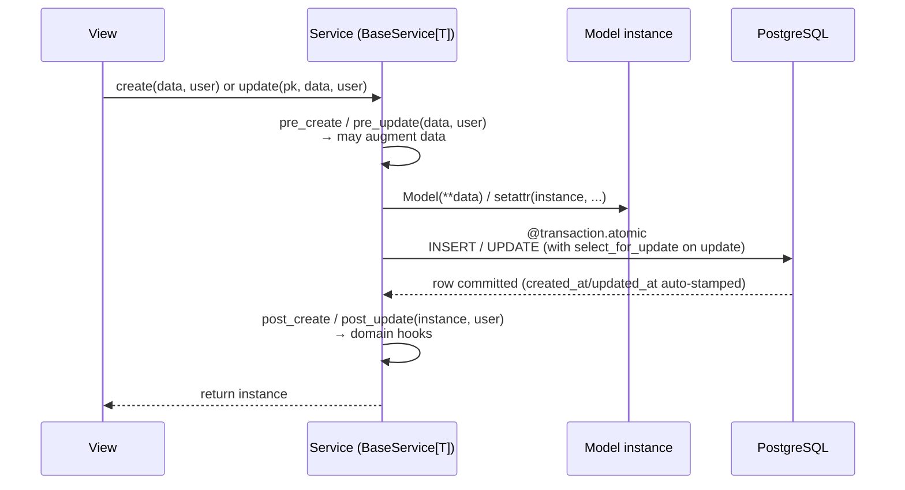
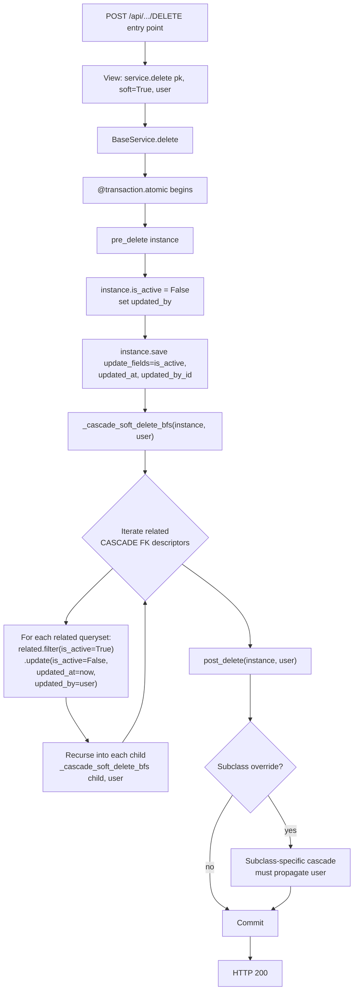

# Audit trail

Every mutating operation stamps four fields on the affected row: `created_by`,
`updated_by`, `created_at`, `updated_at`. The mechanism is uniform via
`BaseService` hooks — but the **cascade path** (how those stamps propagate
through soft-deletes of a parent row and its children) is subtle enough to
deserve its own reference.

> **Base class:** `apps/core/base/service.py::BaseService` ·
> **Model fields:** `apps/core/base/model.py::BaseModel` ·
> **Conventions:** [../apps/core/CLAUDE.md](../apps/core/CLAUDE.md)

## Audit fields

Defined on `BaseModel` (abstract; all domain models inherit):

| Field | Type | Populated by |
|---|---|---|
| `created_by` | `FK(User, null=True, SET_NULL)` | `BaseService.create` (from `user` arg) + any admin `save_model` override. |
| `updated_by` | `FK(User, null=True, SET_NULL)` | `BaseService.update` / `BaseService.delete` + every cascade soft-delete call that carries a user. |
| `created_at` | `DateTimeField(auto_now_add=True)` | Django — set automatically on INSERT. |
| `updated_at` | `DateTimeField(auto_now=True)` | Django — set automatically on every `.save()`. **NOT** set by `QuerySet.update()` or `bulk_update()` — must be included in `update_fields` / kwargs explicitly. |

## BaseService hook sequence (create / update)

## Audit field decision table

For every mutating operation, this is which audit fields get stamped and by
which hook.

| Operation | `created_by` | `updated_by` | `created_at` | `updated_at` | Stamped by |
|---|---|---|---|---|---|
| `service.create(data, user)` | **user** | — | auto (INSERT) | auto (`.save()`) | `BaseService.create` sets `created_by` when the model has the field. |
| `service.update(pk, data, user)` | unchanged | **user** | unchanged | auto (`.save()`) | `BaseService.update` sets `updated_by` after `pre_update`. |
| `service.delete(pk, user)` — soft delete, main row | unchanged | **user** | unchanged | explicit (`.save(update_fields=[..., "updated_at"])`) | `BaseService.delete` includes `updated_at` and `updated_by_id` in `update_fields`. |
| `service.delete(pk, user)` — cascade to CASCADE FK children | unchanged | **user** (propagated) | unchanged | explicit (`QuerySet.update(updated_at=..., updated_by=...)`) | `_cascade_soft_delete_bfs(instance, user=user)` passes both fields to `.update()` for every related queryset. |
| `service.delete(pk, user)` — subclass `post_delete` cascading manually | unchanged | **user** (propagated) | unchanged | explicit | Subclass-overridden `post_delete(instance, user=None)` runs `bulk_update`. Override **MUST** accept `user` and forward it. |
| Bulk operations via `service.bulk_update(instances, fields)` | unchanged | only if caller set it on each instance | unchanged | only if `"updated_at"` is in `fields` | `bulk_update` is a thin wrapper — audit stamping is the caller's responsibility. |
| System-triggered updates (no user) | unchanged | **NOT stamped** | unchanged | auto / explicit | When the actor is the system (scheduled job, signal handler), pass `user=None` so audit doesn't misattribute the change. |

## Cascade soft-delete flowchart

The end-to-end propagation when a row is soft-deleted and that soft-delete
must cascade to CASCADE-FK children.

The key invariants enforced by this design:

1. **`updated_by` reaches every row touched by the cascade.** No row flips
   `is_active=False` with a stale `updated_by` attribution.
2. **`updated_at` is explicit in every cascade `.update()` / `bulk_update`.**
   Django does not auto-stamp `auto_now` during `QuerySet.update()` —
   forgetting `updated_at` silently leaves the old timestamp.
3. **Subclasses that override `post_delete` MUST accept `user=None` and
   forward it.** The base signature is `post_delete(instance, user=None)`;
   every override must respect the `user` argument or cascade rows end up
   with NULL `updated_by`.
4. **Cascade depth is bounded** by `BaseService.MAX_CASCADE_DEPTH`
   (default 10). The walk is breadth-first; at the cap the cascade
   short-circuits and logs WARNING with `model`, `pk`, and `depth`.
   This protects against circular soft-FK chains a future contributor
   might introduce. Subclasses can override the class attribute if a
   legitimate cascade exceeds 10 levels — but consider whether the
   cycle is the actual bug first.

## Failure modes to watch for

- **Forgetting `updated_at` in `bulk_update` `update_fields`.** Django's
  `auto_now` only fires on `.save()`. Every cascade `bulk_update` must list
  both `updated_at` and `updated_by` explicitly.
- **`.update(is_active=False)` without audit fields.** `QuerySet.update`
  bypasses `.save()` entirely; neither auto-field fires. Always build the
  kwargs: `.update(is_active=False, updated_at=timezone.now(), updated_by=user)`.
- **Cascade hook that swallows `user`.** If `post_delete(instance)` doesn't
  accept `user`, the cascade rows end up with NULL `updated_by`.
- **Direct ORM edits bypassing the service layer.** Programmatic shell edits
  via `Model.objects.filter(...).update(...)` skip every hook. Shell sessions
  should go through the service layer when audit matters; otherwise stamp
  `updated_at` / `updated_by` by hand.
- **`created_by` on creation when the actor is the system.** Passing
  `user=None` to `service.create()` leaves `created_by` NULL — that's the
  correct state for system-created rows; downstream code must tolerate NULL
  on either audit field.

## Related docs

- [../apps/core/CLAUDE.md](../apps/core/CLAUDE.md) — BaseModel / BaseService
  conventions including the hook contract.
- [architecture.md](architecture.md) — where the service layer sits.
- [exceptions.md](exceptions.md) — error-handling boundaries around service
  methods.
