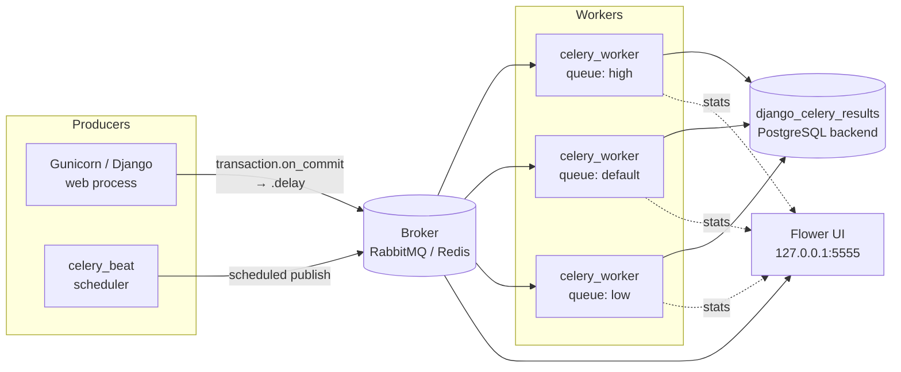
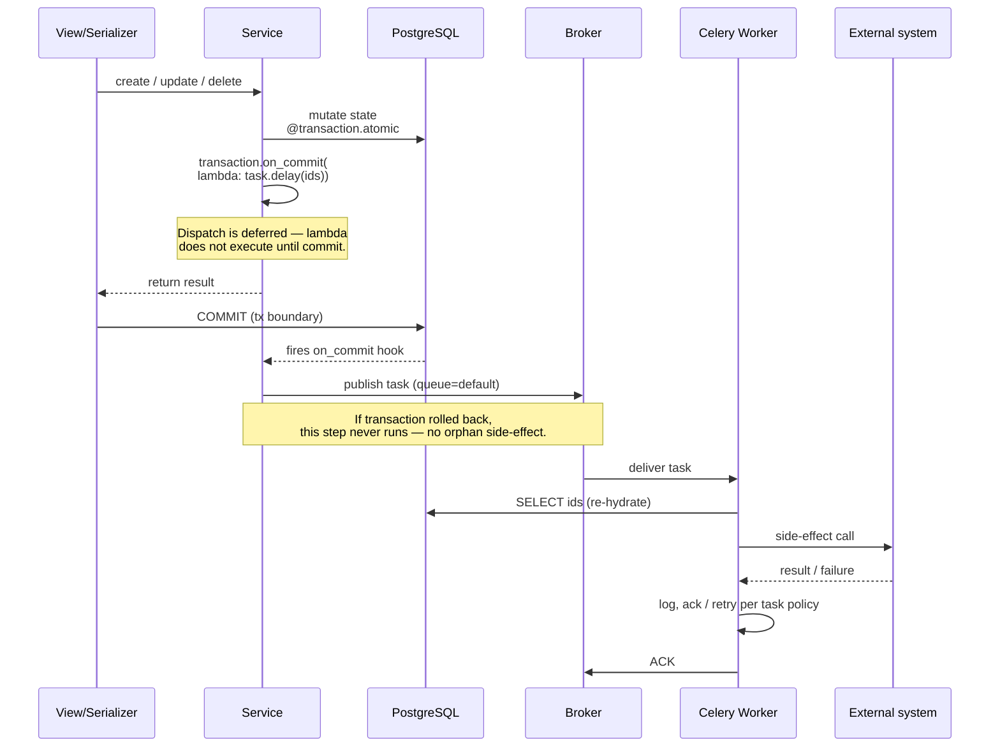

# Celery topology

How async work is structured in the boilerplate: one broker, three priority
queues (by convention), `transaction.on_commit`-mediated dispatch from the
web tier, and a `django_celery_results` PostgreSQL backend.

> **Celery app:** `config/celery.py` · **Settings:** `config/settings/base.py`
> (search `CELERY_`) · **Compose services:** `docker-compose.yml` ·
> **Resilience interaction:** [resilience.md](resilience.md)

## Components

- **Producer side** — the Django web process should never call `.apply_async`
  / `.delay` directly inside a transaction. Wrap dispatch in
  `transaction.on_commit(lambda: task.delay(...))` so a rolled-back outer
  transaction never produces an orphan side-effect. Beat-scheduled tasks
  publish directly (no outer transaction to worry about).
- **Broker** — defaults to whatever `CELERY_BROKER_URL` points at. RabbitMQ
  (`rabbitmq:3.13-management`) is the recommended production choice; Redis /
  Valkey works for low-volume setups. The management UI on RabbitMQ
  (`localhost:15672/`) is useful for ops inspection.
- **Workers** — separate containers (or worker groups) bound to the three
  queues. Concurrency tuned via `CELERY_WORKER_CONCURRENCY`
  (`CELERYD_CONCURRENCY` env var) per worker — defaults vary per environment
  (see `config/settings/{local,uat,prod}.py`).
- **Result backend** — `django_celery_results` writes task results into
  PostgreSQL (`CELERY_RESULT_BACKEND=django-db` by default). Used for
  observability and chained orchestration; results expire per
  `CELERY_RESULT_EXPIRES` (default 1h).
- **Flower** — bind to `127.0.0.1:5555` (do not expose publicly). Use for
  queue depth, task latency, retry inspection.

## Queue routing

The boilerplate ships no domain tasks, but the queue tiering convention is
worth adopting from day one:

| Queue | Purpose | Typical latency | Example tasks |
|---|---|---|---|
| `high` | Time-critical dispatch. Must complete within seconds or the side-effect's value degrades. | < 5 s | UI-blocking notifications, OTP delivery, real-time webhooks. |
| `default` | Best-effort notifications, periodic summaries, medium-importance external calls. | < 30 s | Transactional emails, async indexing, partner pushes. |
| `low` | Batch jobs, housekeeping, reports. Can tolerate queue-wait under load. | < 10 min | Nightly aggregates, retention sweeps, report generation. |

Queue selection rules:

1. **Blocks a user-visible UI** → `high`.
2. **Fan-out notification, user not watching** → `default`.
3. **Nightly / weekly job** → `low`.
4. **Dispatch from `transaction.on_commit`** → always best-effort; most such
   tasks belong on `default`.

Explicit queue routing happens per-task via `@shared_task(queue="<queue>")`
or at `.apply_async(queue=...)`. Don't rely on the default routing key — be
explicit.

## Dispatch sequence (generic shape for any on_commit-driven task)

The re-hydrate step matters — never pass model instances across the broker.
Pass primary keys and re-fetch in the worker so the task always operates on
the latest row state.

## Beat schedule

`CELERY_BEAT_SCHEDULE` lives in `config/settings/base.py`. The boilerplate
ships an empty schedule — the `celery_beat` container is wired so future
periodic tasks (cache cleanup, audit sweeps, rate-limit GC) can land without
infra changes.

When you add a Beat entry:

1. Register the schedule in `CELERY_BEAT_SCHEDULE` with an explicit cadence.
2. Route the task to a queue with `options={"queue": "low"}`.
3. Document the cadence + queue in this file alongside any other tasks.

## Failure modes & resilience

- **Broker outage** — `.delay()` raises if the broker is unreachable.
  Web-tier callers should treat this as **fail-CLOSED** for critical paths
  (write a row to an outbox table first, then dispatch from a worker that
  drains the outbox) and **fail-OPEN** with structured logging for advisory
  paths (e.g. transactional emails — the action that triggered the email
  already committed; losing the email is recoverable).
- **Worker crash mid-task** — Celery re-delivers after the visibility
  timeout. Tasks must be **idempotent**; use a unique key (DB row, idempotency
  table, Redis SET-NX) when the side-effect can't tolerate a double-send.
- **Task pile-up** — Flower's queue depth panel is the primary signal; pair
  with a Prometheus scrape on the broker if you have one. Drain by scaling
  workers, not by purging — purging loses work.
- **Result backend bloat** — `CELERY_RESULT_EXPIRES=3600` keeps the result
  table bounded; run `celery -A config.celery purge` or the
  `django_celery_results` cleanup task on a Beat schedule if you keep results
  longer.

## Ops notes

- **Drain a queue** — `docker compose exec celery_worker celery -A config.celery purge -Q <queue>` (destructive; prefer scaling workers).
- **Monitor depth** — Flower at `localhost:5555` ("Queues" tab) or the broker's native UI.
- **Inspect a task's history** — Flower "Tasks" tab; for deeper history query `django_celery_results_taskresult` in Postgres.
- **Worker concurrency** — `CELERY_WORKER_CONCURRENCY` (default differs per env). For I/O-bound tasks the limit is the external service quota, not CPU; pin concurrency explicitly when scaling workers horizontally.
- **Graceful shutdown** — `docker compose kill -s TERM celery_worker` drains in-flight tasks before exit.

## Related docs

- [resilience.md](resilience.md) — the `@resilient` decorator is compatible
  with Celery tasks; circuit breaker state is shared via Valkey across
  workers.
- [thread-safety.md](thread-safety.md) — module-level state in tasks shares
  the same thread-safety contract as the web tier.
- [scalability.md](scalability.md) — worker / pool sizing math.
- [architecture.md](architecture.md) — where Celery sits in the overall
  topology.
