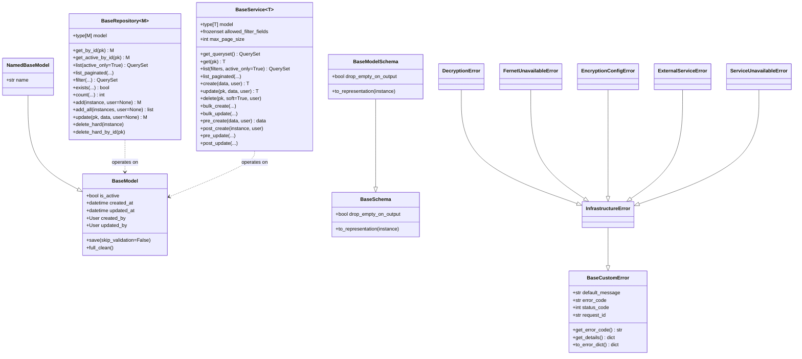
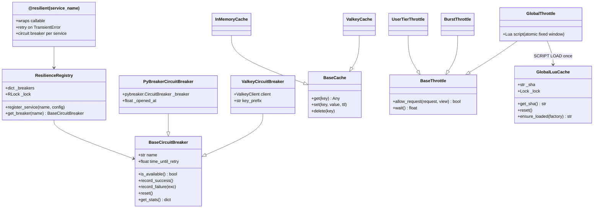
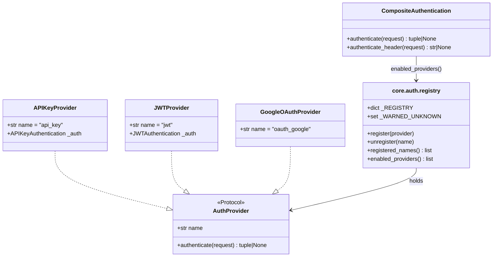

# Class Diagrams

Mermaid class diagrams for the base hierarchy and the resilience
layering. GitHub renders these natively.

## Base hierarchy

## Resilience layering

## Auth provider chain

## Related reading

- [data-model.md](data-model.md) — `BaseModel` / `BaseService` contract.
- [resilience.md](resilience.md) — `@resilient` decorator behaviour.
- [authentication.md](authentication.md) — provider chain at request time.
- [exceptions.md](exceptions.md) — full `BaseCustomError` hierarchy.
