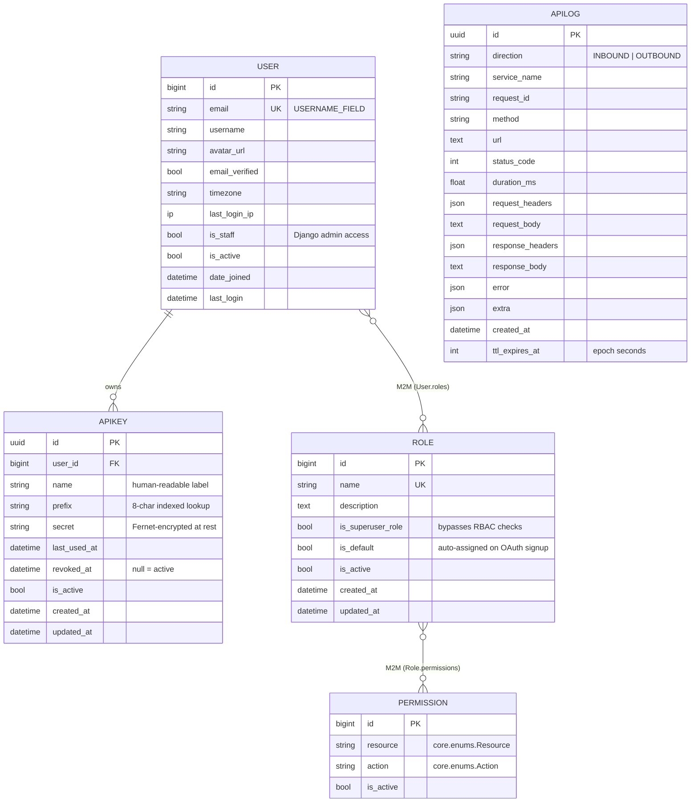

# Entity-Relationship Diagram

Mermaid-rendered ERD for the shipped models. GitHub renders this
natively; no external tool required.

## Constraints worth noting

- `Permission(resource, action)` is unique — see
  `apps/accounts/models.py:29-44` for the `UniqueConstraint` +
  `CheckConstraint` pair.
- `APIKey.prefix` has a **partial index** scoped to
  `is_active=True AND revoked_at IS NULL` — see
  `apps/accounts/models.py:172-176`. The hot lookup path
  (`prefix=..., is_active=True, revoked_at__isnull=True`) is
  index-only.
- `APILog` has composite indexes on `(service_name, created_at)` and
  `(direction, created_at)` for the audit dashboard.
- `User.email` is `USERNAME_FIELD`; do not change after first
  migration — see `apps/accounts/CLAUDE.md`.

## Soft-delete

Models inheriting from `BaseModel` (`APIKey`) carry an `is_active`
flag and route writes through `BaseService.delete(soft=True, user)`
which cascades soft-deletes via
`BaseService._cascade_soft_delete_bfs`.
`User`, `Role`, `Permission` carry `is_active` too but use Django
auth's own semantics for `User.is_active`.

## Related reading

- [data-model.md](data-model.md) — `BaseModel` / `BaseService` contract.
- [authentication.md](authentication.md) — how `APIKey` and JWT flow
  through the auth provider registry.
- [audit-trail.md](audit-trail.md) — `APILog` write pipeline.
