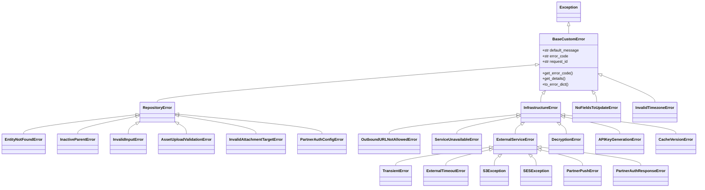
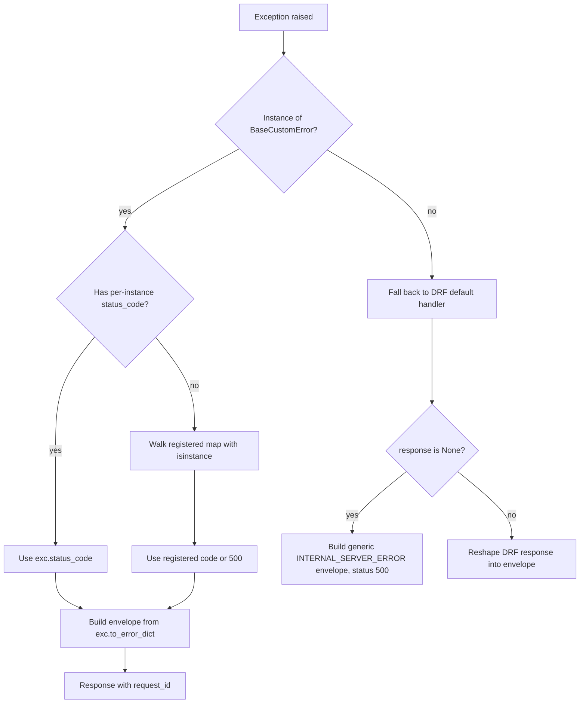

# Exceptions

> **Class diagram:** [data-model.md](data-model.md) · **HTTP status codes:** [api.md](api.md#http-status-codes) · **Resilience integration:** [resilience.md](resilience.md) · **Source:** `apps/core/exceptions/`, `apps/core/base/exception.py`

Every error that escapes a service into the DRF layer flows through one
typed exception hierarchy rooted at ``BaseCustomError``. The custom DRF
handler (`api_exception_handler`) inspects the type, looks up the HTTP
status from a registry, and emits the standard response envelope.

> Hierarchy + registry last verified against code on 2026-05-28
> (exception-system audit follow-up). To re-audit, run
> `grep -rn "class .*\(Error\|Exception\)\b" apps/` and
> `grep -rn "register_exception_mapping" apps/` and reconcile against
> the diagram and the registry table below.

## Three core concepts

1. **Hierarchy.** Two top-level branches under `BaseCustomError`:
   `RepositoryError` (data access / business invariants stored in the DB)
   and `InfrastructureError` (external systems, internal subsystems).
   Domain apps add their own subclasses under either branch.
2. **Error code derivation.** `BaseCustomError._derive_error_code()`
   strips a trailing `Error`/`Exception` and converts the class name to
   `UPPER_SNAKE_CASE`. `EntityNotFoundError` → `ENTITY_NOT_FOUND`. You
   can override by setting `error_code = "..."` on the class.
3. **Status-code registry.** A lazy-frozen tuple of
   `(exception_class, http_status)` pairs in `core/exceptions/handler.py`.
   Domain apps append entries via `register_exception_mapping()`; the
   handler walks the list in registration order with `isinstance()`.

## Class hierarchy



## Status-code registry

Default mapping (registered in `apps/core/exceptions/handler.py`):

| Exception | HTTP | Notes |
|---|---|---|
| `EntityNotFoundError` | 404 | |
| `InactiveParentError` | 409 | |
| `OutboundURLNotAllowedError` | 400 | SSRF guard / allow-list rejections (infrastructure family) |
| `InvalidInputError` | 400 | Bad input to core/utils helpers |
| `ServiceUnavailableError` | 503 | Circuit breaker open |
| `ExternalTimeoutError` | 502 | |
| `S3Exception` | 502 | |
| `SESException` | 502 | |
| `ExternalServiceError` | 502 | Catch-all — must be **last** |
| `BaseCustomError` (default) | 500 | When no specific match |
| `CacheVersionError` | 500 | Inherited from `InfrastructureError` (no own mapping) |

Domain apps add to this map at startup. Currently registered in
`AppConfig.ready()`:

| Exception | HTTP | Registered in |
|---|---|---|
| `NoFieldsToUpdateError` | 400 | `accounts.apps.AccountsConfig` |
| `InvalidTimezoneError` | 400 | `accounts.apps.AccountsConfig` |
| `APIKeyGenerationError` | 500 | `accounts.apps.AccountsConfig` |
| `PartnerAuthConfigError` | 500 | `partners.apps.PartnersConfig` |
| `AssetUploadValidationError` | 400 | `assets.apps.AssetsConfig` |
| `InvalidAttachmentTargetError` | 400 | `assets.apps.AssetsConfig` |

Anything that *inherits* from a registered class without its own entry
falls through to the parent's status code on `isinstance()`. For
example, `PartnerAuthResponseError` inherits `ExternalServiceError`, so
the core registry's `ExternalServiceError → 502` mapping covers it
without an explicit registration in `partners.apps.PartnersConfig`.

### Registration ordering rule

`isinstance()` walks the list in order, so **register subclasses before
their parents**. If `ExternalServiceError → 502` were registered before
`S3Exception → 502`, that ordering still works because both map to the
same status; but a subclass that should map to a *different* status from
its parent must come first.

### Adding a new exception (recipe)

1. Pick the right branch:
   * Missing/invalid stored data → subclass `RepositoryError` (or
     `EntityNotFoundError` if literally not-found).
   * External call failure → subclass `ExternalServiceError` (or
     `TransientError` for retryable signals).
   * Internal subsystem failure → subclass `InfrastructureError` directly.
   * Generic domain rule violation in a service → subclass
     `BaseCustomError` and pass `status_code=4xx`. Prefer promoting a
     stable mapping to a typed subclass via
     `register_exception_mapping()` once the rule recurs.

2. Define the class with the docstring template:

   ```python
   class MyError(InfrastructureError):
       """One-line summary.

       Raised when: <conditions>.
       Maps to: HTTP <code> (registered in <module>).
       Error code: ``MY`` (auto-derived).
       Typical caller: <where>.
       """

       default_message = "Something went wrong."
   ```

3. Register the status code from your app's `AppConfig.ready()`:

   ```python
   from rest_framework import status
   from core.exceptions.handler import register_exception_mapping
   from myapp.exceptions import MyError

   register_exception_mapping(MyError, status.HTTP_409_CONFLICT)
   ```

   Domain-app exceptions live in `apps/<app>/exceptions.py` and register
   their own mappings — `apps/core/` does not import from domain apps
   (see `apps/core/CLAUDE.md`).

4. Add tests asserting both the type and the resulting HTTP status (see
   [Testing](#testing)).

## DRF handler flow



Unhandled non-DRF exceptions hit the `response is None` branch — the
handler still returns the standard `{success, errors, request_id}`
envelope with `code: INTERNAL_SERVER_ERROR` at status 500.
`ExceptionLoggingMiddleware` captures `exc_info` upstream, so
observability is intact even though the client sees a generic shape.

Key files: `apps/core/exceptions/handler.py:74` (`api_exception_handler`)
and `handler.py:169` (`register_exception_mapping`).

## When to use which subclass

| Situation | Use |
|---|---|
| Single-row lookup returned no result | `EntityNotFoundError(entity_name, entity_id)` |
| Activating a row whose parent is inactive | `InactiveParentError("…")` |
| Outbound URL failed SSRF / allow-list check | `OutboundURLNotAllowedError("…")` (from `core.exceptions.infrastructure`) |
| Invalid input to a shared core/utils helper (S3 URI, filter coercion, oversized string) | `InvalidInputError("…")` |
| Cache backend cannot bump a version counter | `CacheVersionError("…")` |
| Generic data-access invariant broken | `RepositoryError` subclass |
| Circuit breaker open for a service | `ServiceUnavailableError(service_name)` |
| External HTTP call timed out | `ExternalTimeoutError` |
| S3 operation failed | `S3Exception` |
| SES operation failed (non-retryable) | `SESException` |
| Retryable external signal (429, throttle) | `TransientError` |
| Partner push-lead failed | `PartnerPushError` |
| Partner auth config invalid | `PartnerAuthConfigError` |
| Partner login response malformed | `PartnerAuthResponseError` |
| Encrypted-field decryption failed | `DecryptionError` |
| API-key prefix retries exhausted | `APIKeyGenerationError` |
| Domain rule violation from a service (e.g., uniqueness, state) | Subclass `BaseCustomError`; pass `status_code=4xx` (queries convention) |
| Request payload validation | DRF `serializers.ValidationError` (NOT a custom exception) |
| Model-level validation at `full_clean()` | Django `ValidationError` (handled by DRF) |

## Catching exceptions

* **Never catch upstream of `ExceptionLoggingMiddleware`.** That
  middleware is responsible for the structured-log line that pairs an
  exception with its request_id; swallowing the exception earlier
  silently drops the audit trail. See `apps/core/CLAUDE.md`.
* **Never catch a typed exception in a view to remap its status code.**
  If you need a 4xx for a typed exception, register the mapping in
  `AppConfig.ready()` and let the handler emit the standard envelope —
  including the auto-derived `errors[].code`. View-layer try/except
  blocks that rebuild `ErrorResponse(message=..., errors=None)` strip
  the `error_code` off the wire and create two coexisting strategies
  for status mapping inside the same app. (Catching to *recover* — log
  and retry, fall back to a default value — is fine; catching to
  *re-shape* the response is not.)
* **`@resilient` and `excluded_exceptions`.** The retry decorator skips
  retries for any exception in the configured `excluded_exceptions`
  tuple — typically `ServiceUnavailableError` (circuit already open) and
  domain exceptions that are not retryable. See `docs/resilience.md`.
* **Service-to-service propagation.** If service B catches an exception
  from service A, it should either re-raise the same typed exception or
  wrap it in a more specific one — never collapse to `Exception` or a
  Python built-in.
* **Aggregate boundaries catch `ExternalServiceError` only.** A service
  that calls multiple external systems should wrap `ExternalServiceError`
  (which covers `S3Exception`, `SESException`, `ExternalTimeoutError`,
  etc.) into a single typed 502 so callers get one shape per attempt.
  Config-shaped failures (auth-config errors, `RepositoryError`) should
  escape unwrapped and surface as 500 — they signal a stored-data
  integrity issue, not a transient external problem.

## Anti-patterns

* `raise Exception("…")` — bare base class loses all type info; DRF
  handler can't recognize it. Always pick a subclass.
* `raise RuntimeError("…")` / `raise ValueError("…")` from anywhere
  reachable by a request — these escape into views as opaque 500s with
  no error code. Wrap in a typed custom exception. Examples: an invalid
  S3 URI in `core.utils.s3` and a malformed filter param in
  `core.utils.filters` now raise `InvalidInputError` (400) instead of
  bare `ValueError` (500). `ValueError` is only acceptable in true
  programmer-error / boot-time sites whose callers translate it — e.g.
  `core.responses.paginated`, `core.base.service`, `core.utils.valkey`
  config validation. If a `ValueError` can reach the DRF handler on a
  user request, it's the wrong type.
* `raise django.core.exceptions.ValidationError(...)` from a service
  layer — wrong layer; serializers do request validation. From a service,
  raise a typed `BaseCustomError` subclass with `status_code=4xx`.
* `raise BaseCustomError("…")` with no `status_code` and no subclass —
  defaults to 500, which is rarely what you want. Either add
  `status_code=4xx` for an ad-hoc rule violation or define a typed
  subclass. Recurring inline `status_code=` overrides should be promoted
  to a registered subclass — that's what the SSRF guard's six 400s
  became (`OutboundURLNotAllowedError`).
* **Subclass `__init__` that drops `status_code`.** When overriding
  `__init__` on a `BaseCustomError` subclass, always accept and forward
  `*, status_code: int | None = None` to `super().__init__`. Dropping
  the kwarg silently disables per-instance overrides and breaks the
  documented `(message, *, status_code)` contract.
* **Partial migrations.** When migrating a module from bare exceptions
  to the typed hierarchy, sweep all `raise ValueError`/`raise RuntimeError`
  sites in the same PR. Leaving two of six raises behind is what produced
  ISSUE-204 — half the module spoke the typed contract and half didn't.
  Pre-merge check: `grep -n "raise \(ValueError\|RuntimeError\|Exception\)" <module>`
  and justify each remaining hit.
* **View-layer try/except for status remap.** Catching a typed exception
  in a view to manually rebuild `ErrorResponse(...)` bypasses the registry
  and strips `errors[].code` from the response. Register the mapping in
  `AppConfig.ready()` instead; see [Catching exceptions](#catching-exceptions).

## Testing

Assert on the type, not the message:

```python
import pytest
from accounts.exceptions import APIKeyGenerationError
from accounts.models import APIKey

def test_api_key_generation_exhausts_retries(monkeypatch):
    monkeypatch.setattr("secrets.token_urlsafe", lambda n: "fixed-prefix-collide")
    with pytest.raises(APIKeyGenerationError):
        APIKey.create_key(user=user, name="x")
```

Assert on the response envelope at the view level:

```python
response = client.post("/api/some-endpoint/", payload)
assert response.status_code == 502
assert response.data["errors"][0]["code"] == "PARTNER_AUTH_RESPONSE"
```

The handler always echoes `request_id` in the envelope — useful for
end-to-end tracing assertions.
