# Resilience Patterns

## Overview

The Co-Lending Gateway implements defense-in-depth resilience across three layers:

1. **Nginx** — Rate limiting at the reverse proxy (first line of defense)
2. **DRF Throttles** — Application-level rate limiting per user tier
3. **Service-Level** — Circuit breaker, retry, and caching for external service calls

All resilience components are designed to **fail-open**: if the resilience infrastructure itself fails (e.g., Valkey goes down), requests are allowed through rather than blocking all traffic.

---

## Circuit Breaker

### States

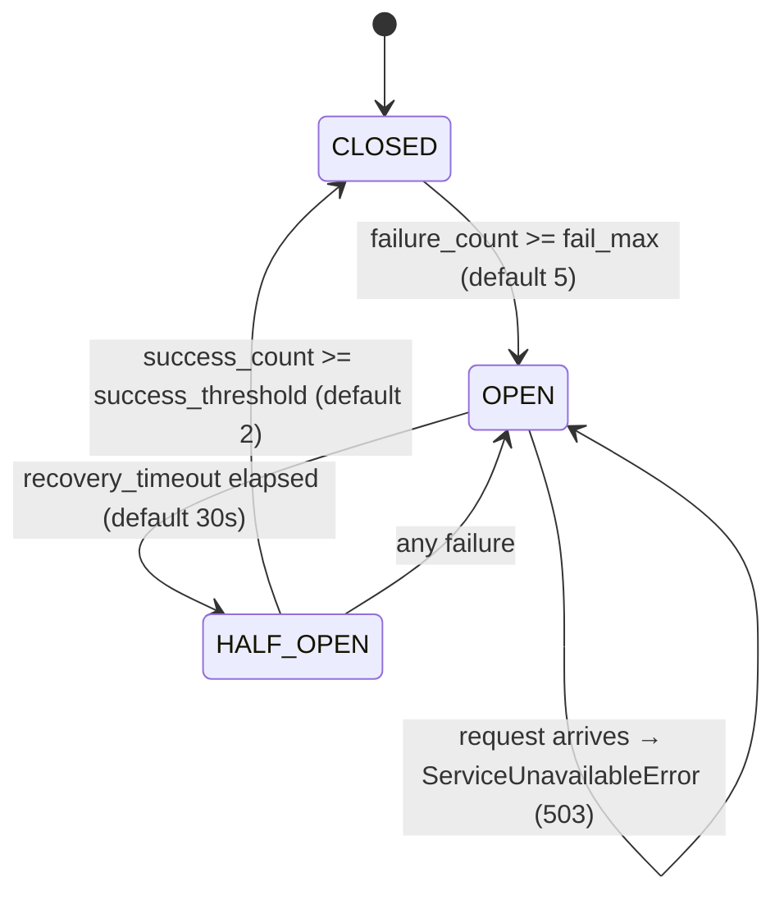

| State | Behaviour |
|-------|-----------|
| CLOSED | Normal — all requests pass through |
| OPEN | Short-circuit — immediately raises `ServiceUnavailableError` (503) |
| HALF_OPEN | Trial — limited requests probe recovery |

### Backend Selection (Provider Pattern)

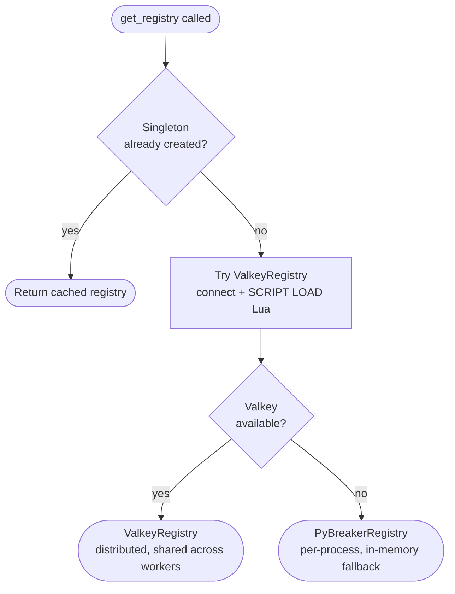

**Valkey backend** (preferred):
- State stored as Valkey hash `cb:{service_name}`
- Fields: `state`, `failure_count`, `success_count`, `last_failure`
- TTL: `recovery_timeout × 10` (refreshed on every write)
- All state transitions via a single atomic Lua `EVALSHA` — no race conditions across Gunicorn workers

**PyBreaker backend** (fallback):
- In-memory state, isolated per worker process
- Workers can have diverging views of circuit state
- Used transparently when Valkey is unavailable

### Per-Request Flow

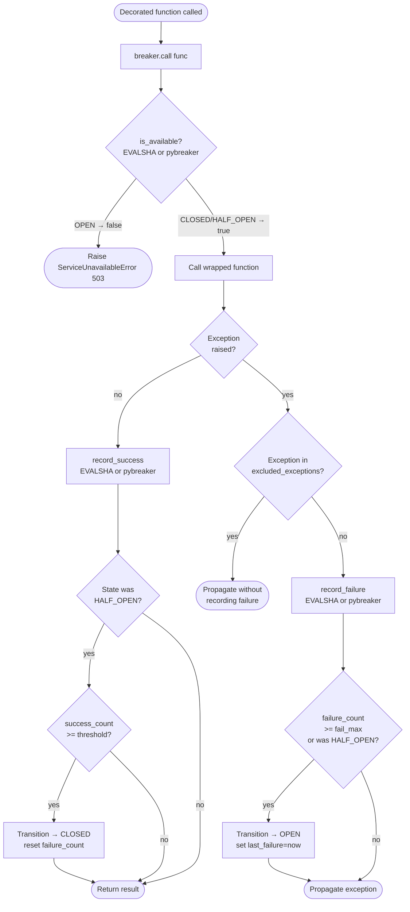

### Valkey Lua Script (Atomicity)

All state reads and writes happen in a **single EVALSHA round-trip** using the `CIRCUIT_BREAKER_LUA_SCRIPT`. The script:
1. Reads the current hash state
2. Checks if an OPEN circuit has timed out (auto-transitions to HALF_OPEN)
3. Applies the requested action (`is_available`, `record_success`, `record_failure`, `reset`)
4. Writes back the new state with a refreshed TTL

This makes all state transitions atomic — no multi-step read/modify/write race between concurrent workers.

### Valkey Fallback (per-breaker)

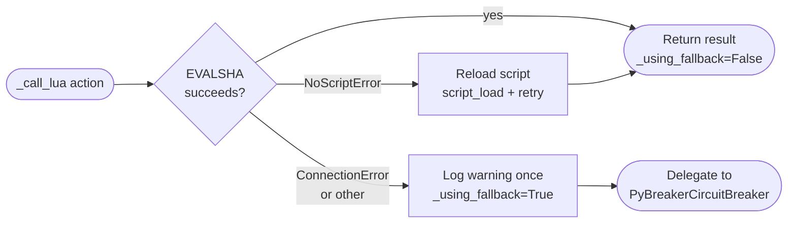

### Configuration

```python
RESILIENCE_DEFAULTS = {
    "circuit_breaker": {
        "fail_max": 5,              # Failures before OPEN
        "reset_timeout": 30,        # Seconds in OPEN before HALF_OPEN
        "success_threshold": 2,     # Successes in HALF_OPEN to close
        "excluded_exceptions": [],  # Never counted as failures
    }
}
```

Per-service overrides via the registry:

```python
from core.resilience.registry import registry

registry.register_service("partner_api", {
    "circuit_breaker": {"fail_max": 3, "reset_timeout": 60},
})
```

### Usage

```python
from core.resilience.decorators import circuit_breaker

@circuit_breaker("partner_api")
def call_partner(url, data):
    return make_http_request("POST", url, json_body=data)
```

---

## Retry

### Flow

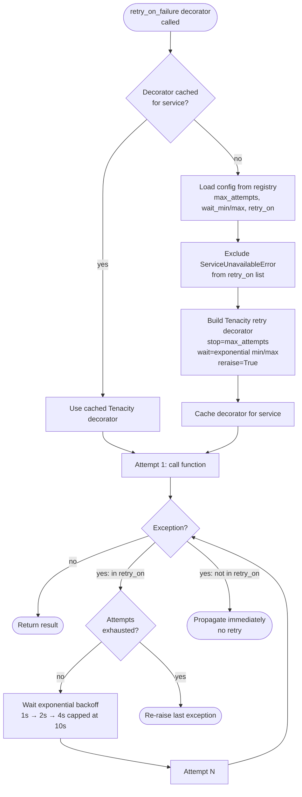

### Exception Hierarchy for Retry

```
BaseCustomError
└── InfrastructureError
    ├── TransientError          ← retried by default
    ├── ExternalTimeoutError    ← retried by default
    ├── ServiceUnavailableError ← NEVER retried (open circuit guard)
    ├── ExternalServiceError    ← not retried by default
    ├── S3Exception             ← not retried by default
    └── PartnerPushError        ← not retried by default
```

**Why `ServiceUnavailableError` is excluded**: when used inside `@resilient`, the circuit breaker wraps the retried function. If a retry attempt opens the circuit, subsequent retry attempts would hit the open circuit and raise `ServiceUnavailableError`. Excluding it prevents retry from defeating the circuit breaker.

See [exceptions.md](exceptions.md) for the full typed exception hierarchy and how `excluded_exceptions` interacts with the DRF handler.

### Configuration

```python
RESILIENCE_DEFAULTS = {
    "retry": {
        "max_attempts": 3,
        "wait_min": 1,   # seconds
        "wait_max": 10,  # seconds
        "retry_on": [
            "core.exceptions.infrastructure.TransientError",
            "core.exceptions.infrastructure.ExternalTimeoutError",
        ],
    }
}
```

### Usage

```python
from core.resilience.retry import retry_on_failure

@retry_on_failure("synoriq_db")
def fetch_lead_data(app_number):
    return execute_query(engine, sql, {"app_number": app_number})
```

---

## Combined: `@resilient`

`@resilient("service_name")` = circuit breaker (outer) wrapping retry (inner). The composition matters: the circuit breaker sees the final outcome after all retries, not each individual attempt.

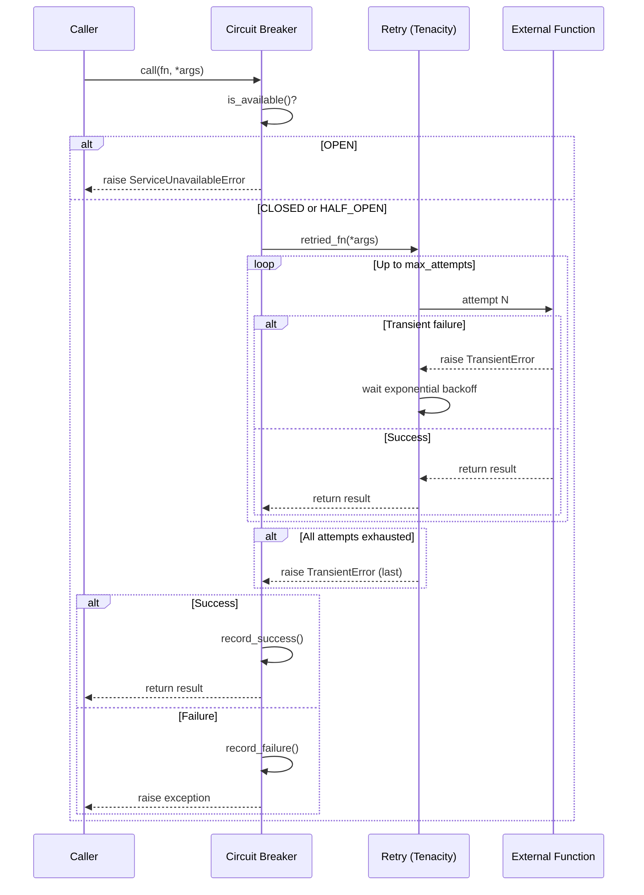

```python
from core.resilience.decorators import resilient

@resilient("s3")
def upload_document(data, bucket, key):
    return upload_json_to_s3(data, bucket, key)
```

---

## Resilience Registry

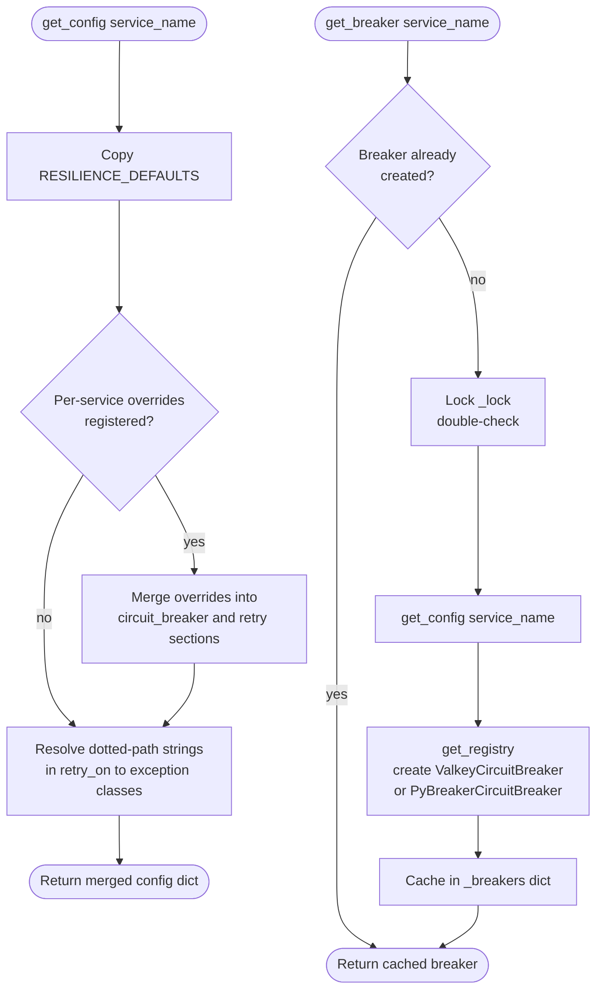

**Registration rules**:
- Call `registry.register_service()` before the first request that triggers `get_breaker()` (typically in `AppConfig.ready()`).
- Registering after a breaker has been created raises `ValueError` — configuration cannot change once the breaker is live.

---

## Rate Limiting (Throttling)

### Three-Layer Defense

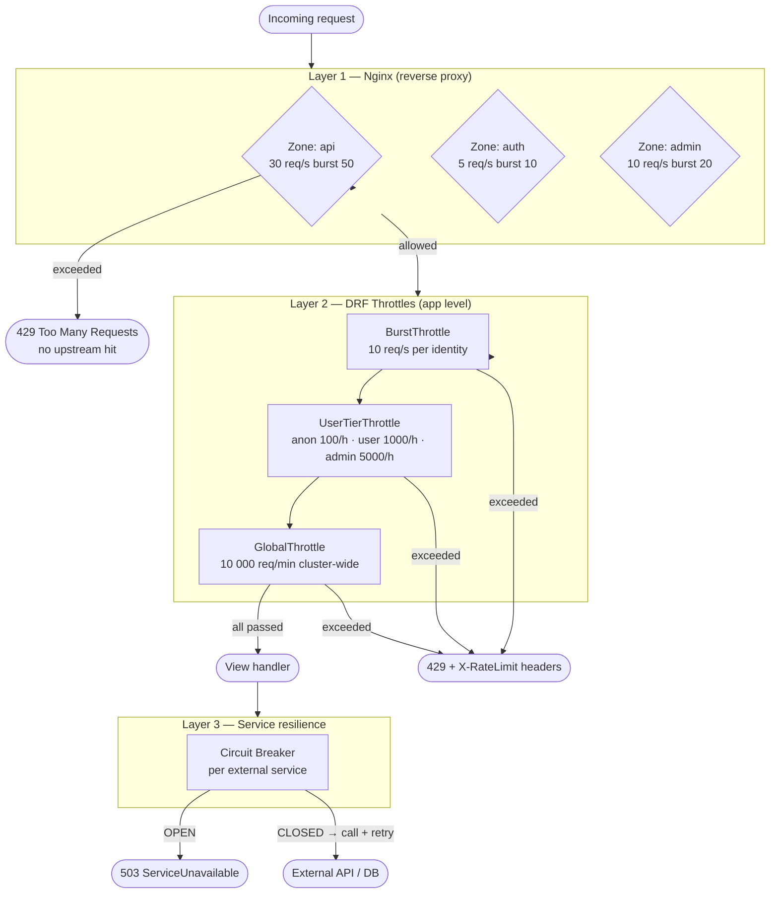

### Throttle Provider Selection

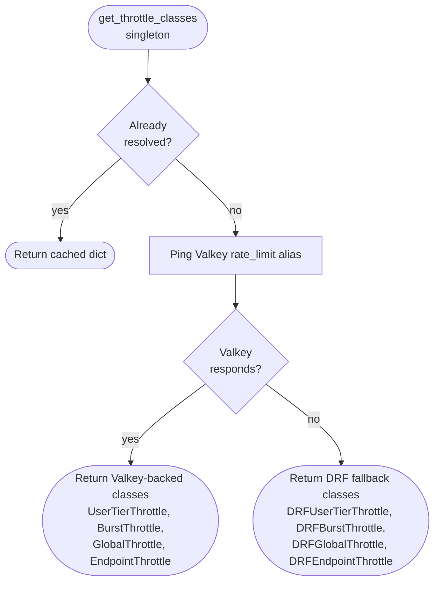

Both sets of classes implement the same `allow_request` interface — DRF and the rest of the app are unaware of which backend is active.

### Per-Request Throttle Flow (Valkey path)

```mermaid
flowchart TD
    A([allow_request called]) --> B{rate is None?}
    B -- yes --> Pass([return True — no limit])
    B -- no --> C[Build cache key:\nthrottle_{scope}_{user_pk or IP}]
    C --> D{Lua script\nloaded?}

    D -- yes\natomic path --> E[EVALSHA THROTTLE_LUA_SCRIPT\nZREMRANGEBYSCORE expire\nZCARD count\nif count < limit: ZADD]
    E --> F{allowed?}
    F -- yes --> G[Set request._throttle_limit\n._throttle_remaining\n._throttle_reset]
    G --> Pass2([return True])
    F -- no --> H[Log throttle_event\nSet remaining=0]
    H --> Fail([return False → 429])

    D -- no\nnon-atomic fallback --> I[CACHE GET key → history list\nDrop entries outside window\nCount remaining]
    I --> J{len history\n>= limit?}
    J -- yes --> H
    J -- no --> K[Insert now into history\nCACHE SET key history duration]
    K --> Pass2
```

### Global Throttle — Sliding Window Counter

The `GlobalThrottle` uses a different algorithm (O(1) vs the O(log n) sorted-set approach used by other throttles) to handle cluster-wide counting cheaply.

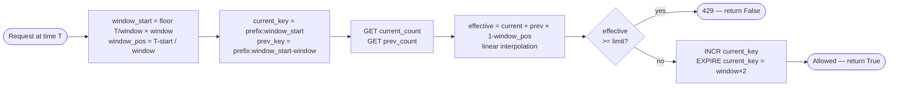

The interpolation smooths bursty traffic at window boundaries without the full history scan that a pure sliding window needs.

### User Tier Resolution

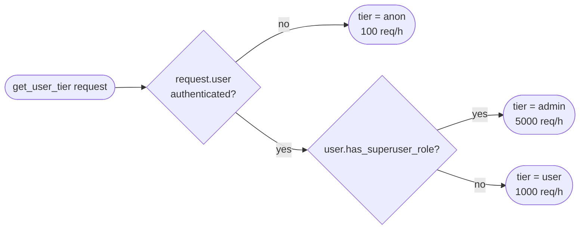

`has_superuser_role` is resolved via `RBACBackend` — users with the superuser Role get admin-tier rate limits automatically.

### Rate Limit Response Headers

`RateLimitHeadersMiddleware` (last in middleware stack) reads attributes set by the throttle on `request` and injects them into the response:

```
X-RateLimit-Limit: 1000        # requests allowed in window
X-RateLimit-Remaining: 997     # requests left before throttle
X-RateLimit-Reset: 1713700000  # unix timestamp of window reset
```

Headers are set only when `RATE_LIMIT_CONFIG["ENABLE_HEADERS"]` is `True` (default). When a request is throttled, `Remaining` is set to `0` and `Retry-After` is returned by DRF.

### Fail-Open Behaviour

| Component | Fail-Open? | What happens on backend failure |
|-----------|------------|--------------------------------|
| Valkey throttle (atomic) | Yes | Exception caught, `fail_open` returned |
| DRF throttle fallback | Yes | Exception caught, `fail_open` returned |
| Global throttle Lua | Yes | Reloads script once, falls back to non-atomic |
| Circuit breaker (Valkey) | Yes | Falls back to per-process PyBreaker |
| Cache provider | Yes | Falls back to in-memory `LocMemCache` |

### Configuration

```bash
# Rate limits (all overridable via env vars)
RATE_LIMIT_ANON=100/hour
RATE_LIMIT_USER=1000/hour
RATE_LIMIT_ADMIN=5000/hour
RATE_LIMIT_BURST=10/second
RATE_LIMIT_GLOBAL=10000/minute
RATE_LIMIT_FAIL_OPEN=true
RATE_LIMIT_ENABLE_HEADERS=true

# Circuit breaker
RESILIENCE_CB_FAIL_MAX=5
RESILIENCE_CB_RESET_TIMEOUT=30

# Retry
RESILIENCE_RETRY_MAX_ATTEMPTS=3
RESILIENCE_RETRY_WAIT_MIN=1
RESILIENCE_RETRY_WAIT_MAX=10
```

## Caching

### Dual-Cache Architecture

| Alias | Valkey DB | Purpose | Fallback |
|---|---|---|---|
| `default` | DB 2 (local) | Application cache (bearer tokens, query results) | In-memory LocMemCache |
| `rate_limit` | DB 3 (local) | Rate limiting, circuit breaker state | In-memory LocMemCache |

Separation ensures rate limiting operations cannot evict application cache entries.

### Cache Provider

```python
from core.resilience.cache.provider import get_cache

cache = get_cache("default")  # or "rate_limit"
cache.set("key", "value", timeout=300)
value = cache.get("key")
```

The provider is a lazy singleton per alias. It tries Valkey first, falls back to in-memory.

### Fail-Open Behavior

The `ValkeyCacheBackend` wraps Django's cache framework with fail-open semantics:
- If Valkey is unavailable, operations silently fall back to `InMemoryCacheBackend`
- Tracks `_using_fallback` flag to avoid log spam
- `is_healthy()` method reports backend status

### Dual-cache read / write flow

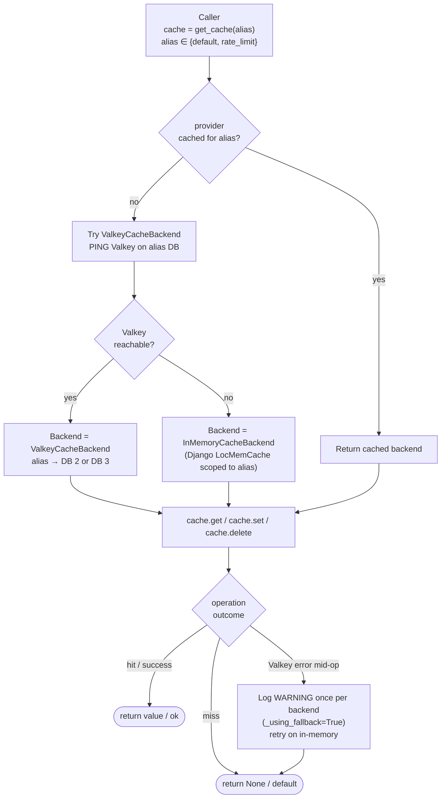

Key properties of this design:
- **Alias isolation.** `default` and `rate_limit` are separate Valkey DBs (2 and 3 locally) — eviction under memory pressure on one cannot evict keys on the other.
- **Fail-open, not fail-closed.** When Valkey is down, callers see cache misses + warn logs, not exceptions. The app continues serving traffic without cache. Callers must design for "cache can return None at any time" regardless.
- **Startup resilience.** If Valkey is unavailable at process start, the provider picks in-memory for the process lifetime. It does **not** auto-recover mid-process — restarting the process re-runs the PING. This is intentional (fail-consistent over fail-sometimes) but means a mid-traffic Valkey recovery does not silently switch back.

See also [thread-safety.md](thread-safety.md) — the provider singletons per alias use `threading.Lock` for first-init and are safe under gthread.

## HTTP Client

For external HTTP calls, use the built-in resilient HTTP client:

```python
from core.utils.http_client import make_http_request

response = make_http_request(
    method="POST",
    url="https://api.partner.com/push",
    headers={"X-Partner-ID": "123"},
    json_body={"lead_data": {...}},
    timeout=30,
    max_attempts=3
)
# response: HttpResponse(status_code, body, headers)
```

Features:
- Thread-local `requests.Session` for connection pooling
- Automatic retry with exponential backoff on 5xx and timeouts
- Raises `TransientError` (5xx) or `ExternalTimeoutError` (timeout)
- Per-`max_attempts` Tenacity state caching

## Monitoring

### Circuit Breaker Stats

```python
from core.resilience.circuit_breaker.provider import get_registry

# Get stats for all breakers
stats = get_registry().get_all_stats()
# {
#   "partner_api": {
#     "state": "closed",
#     "failure_count": 1,
#     "success_count": 42,
#     "time_until_retry": 0
#   }
# }
```

### Observability

- **Structured logs**: All resilience events logged as JSON with request_id context
- **Sentry**: Unhandled exceptions and circuit breaker opens reported to Sentry
- **Flower**: Celery task monitoring (retries, failures, queue depth)
- **Health/Readiness**: `/api/health/` and `/api/readiness/` for load balancer checks
